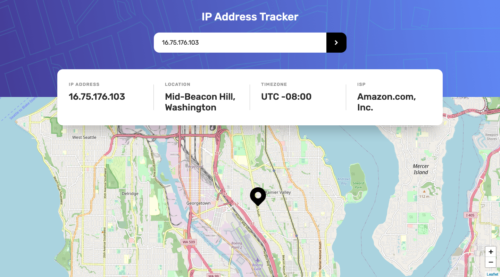

# Frontend Mentor - IP Address Tracker solution

This is a solution to the [IP Address Tracker challenge on Frontend Mentor](https://www.frontendmentor.io/challenges/ip-address-tracker-I8-0yYAH0). Frontend Mentor challenges help you improve your coding skills by building realistic projects. 

## The challenge

Users should be able to:

- View the optimal layout for each page depending on their device's screen size
- See hover states for all interactive elements on the page
- See their own IP address on the map on the initial page load
- Search for any IP addresses or domains and see the key information and location

## Screenshot

### Mobile


### Desktop


## Built with

- Semantic HTML5 markup
- CSS custom properties
- Flexbox
- Mobile-first workflow
- JavaScript
- IP Geolocation API by IPify
- LeafletJS API
- Postman

## What I learned

Over the last week or two I have been learning about how to retrieve data from APIs and how to display this data on my own pages. This is the first Frontend Mentor challenge which has given me the opportunity to utilise the power of APIs.

I was a little overwhelmed to start with as I didn't know how I was supposed to add the map. I therefore began with what I thought I could manage; fetching the data for the IP, location, time zone and ISP using the IP Geolocation API by IPify. It was a simple case of copying the API link from the website, and pasting this into Postman to see how the JSON object was structured, then I could retrieve the necessary data and assign them to the relevant HTML elements like so: 

```js
IP.innerText = data.ip;
SITUATION.innerText = `${data.location.city}, ${data.location.region} ${data.location.postalCode}`;
TIME_ZONE.innerText = 'UTC ' + data.location.timezone;
ISP.innerText = data.isp;
```

I then had to tackle the problem of adding the map using LeafletJS. I went on the Leaflet website and read through their tutorial, plus I watched a YouTube video which demonstrated how to set up the map. To get it to work involves copying some lines of code from the website. This code probably does a lot of stuff behind the scenes that I don't understand. However, eventually I did get the map to show but I just needed to add the custom location marker. This involved copying and pasting a couple more lines of code, then using the IP Geolocation API again to get the latitude and longitude coordinates and pass them into a function. I'm really pleased that everything worked in the end because when I started the challenge I was quite doubtful.

## Continued development

I think I need to practise using APIs a bit more as I'm still not sure what I'm doing some of the time. Unfortunately there's only one other Frontend Mentor challenge at Intermediate difficulty that utilises an API which is a shame. So I will probably do some code-alongs on YouTube to get a little more practice.